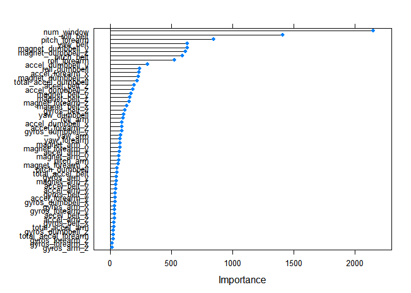

Practical Machine Learning Project
================
Nada Gohider
August 27, 2018

Introduction
------------

The goal of this project is to predict the Quality of Humans' Activities; what is known as Human Activity Recognition (HAR). In particular, this work focuses on the way in which those activities are carried (quality) by studying the manner in which they did the exercies.

Loading the required libraries
------------------------------

``` r
library(caret)
```

    ## Warning: package 'caret' was built under R version 3.4.4

    ## Loading required package: lattice

    ## Loading required package: ggplot2

    ## Warning: package 'ggplot2' was built under R version 3.4.4

``` r
library(Hmisc)
```

    ## Warning: package 'Hmisc' was built under R version 3.4.4

    ## Loading required package: survival

    ## 
    ## Attaching package: 'survival'

    ## The following object is masked from 'package:caret':
    ## 
    ##     cluster

    ## Loading required package: Formula

    ## 
    ## Attaching package: 'Hmisc'

    ## The following objects are masked from 'package:base':
    ## 
    ##     format.pval, units

``` r
library(dplyr)
```

    ## Warning: package 'dplyr' was built under R version 3.4.3

    ## 
    ## Attaching package: 'dplyr'

    ## The following objects are masked from 'package:Hmisc':
    ## 
    ##     src, summarize

    ## The following objects are masked from 'package:stats':
    ## 
    ##     filter, lag

    ## The following objects are masked from 'package:base':
    ## 
    ##     intersect, setdiff, setequal, union

``` r
library(corrplot)
```

    ## Warning: package 'corrplot' was built under R version 3.4.4

    ## corrplot 0.84 loaded

Reading and Exploring Data
--------------------------

I first read the given training and testing datasets, and get rid of all the dirty entries by setting them to NA.

``` r
trndta<-read.csv("pml-training.csv",na.strings = c(NA," ","#DIV/0!"))
tstdta<-read.csv("pml-testing.csv",na.strings = c(NA," ","#DIV/0!"))
```

Before I go deeply through the main analysis for the prediction process, I need to understand the distribution of our data through some statistical techniques.

``` r
attach(trndta)

cbind(freq=table(classe), percentage=prop.table(table(classe))*100)
```

freq percentage A 5580 28.43747 B 3797 19.35073 C 3422 17.43961 D 3216 16.38977 E 3607 18.38243

``` r
 dim(trndta)
```

\[1\] 19622 160

``` r
#str(trndta)

#summary(trndta)
 
plot(trndta$classe,xlab = "Classe", ylab = "Cout" ,main = "Distribution of the Participants Activities' Quality")
```


Data Cleaning and Feature Selection
-----------------------------------

In this part, some features are entierly deleted. By checking the frequency of the Na values, it seems that some features have more than 50% of the observations as NAs.

``` r
L<-sapply(trndta, function(x) sum(is.na(x)))

vec<-which(L>=9608)

clnTrnDta<-trndta[,-vec]

clnTst<-tstdta[,-vec]
```

choose only a particular set of features; Remove features with almost Zero-variation, or not very important in the problem context.

``` r
NZV<-nearZeroVar(clnTrnDta)

clnTrnDta<-clnTrnDta[,-NZV]

clnTst<-clnTst[,-NZV]

clnTrnDta<-clnTrnDta[,-c(1:5)]

clnTst<-clnTst[,-c(1:5)]
```

Data Slicing
------------

``` r
InTrain<-createDataPartition(y=clnTrnDta$classe,p=0.75,list = FALSE)

training<-clnTrnDta[InTrain,]

testing<-clnTrnDta[-InTrain,]
```

Data Exploration with Visualization
-----------------------------------

Since we have a large number of features, I tried to manually select some features (total accelartion) and explore their distribution with repect to the "classe" variable.

``` r
Tot<- which(grepl("^total",names(training),ignore.case = F))

TotalAccel<-training[,Tot]

featurePlot(x=TotalAccel,y= training$classe,plot ="ellipse", main ="Feature Exploration" )
```


Understand the correlation between variables in order to check if we can exclude some redundant variables.

``` r
CorrelationMatrix<-cor(TotalAccel)

print(CorrelationMatrix)
```

    ##                      total_accel_belt total_accel_arm total_accel_dumbbell
    ## total_accel_belt           1.00000000     -0.26267478           -0.1642161
    ## total_accel_arm           -0.26267478      1.00000000            0.1360646
    ## total_accel_dumbbell      -0.16421605      0.13606463            1.0000000
    ## total_accel_forearm        0.03338294     -0.07001312            0.1245825
    ##                      total_accel_forearm
    ## total_accel_belt              0.03338294
    ## total_accel_arm              -0.07001312
    ## total_accel_dumbbell          0.12458254
    ## total_accel_forearm           1.00000000

``` r
highlyCorrelated<-findCorrelation(CorrelationMatrix,cutoff = 0.5)

corrplot(CorrelationMatrix)
```


Model Fitting
-------------

In order to test the robustness of the model that it can be generalized for new "unseen" future data (i.e. so we can avoid overfitting), we applied K-fold as a cross-validation technique with K=5. For the prediction process, I chose Randome Forest since it performs well in terms of its accuracy.

``` r
set.seed(7)

trainControl <- trainControl(method="cv", number=5)

FitMdl<-train(classe~., data=training, method="rf", trainControl=trainControl)

Preds<-predict(FitMdl,testing[,-54])

confusionMatrix(Preds,testing$classe)
```

    ## Confusion Matrix and Statistics
    ## 
    ##           Reference
    ## Prediction    A    B    C    D    E
    ##          A 1394    0    0    0    0
    ##          B    0  949    2    0    0
    ##          C    0    0  853    1    0
    ##          D    0    0    0  803    0
    ##          E    1    0    0    0  901
    ## 
    ## Overall Statistics
    ##                                           
    ##                Accuracy : 0.9992          
    ##                  95% CI : (0.9979, 0.9998)
    ##     No Information Rate : 0.2845          
    ##     P-Value [Acc > NIR] : < 2.2e-16       
    ##                                           
    ##                   Kappa : 0.999           
    ##  Mcnemar's Test P-Value : NA              
    ## 
    ## Statistics by Class:
    ## 
    ##                      Class: A Class: B Class: C Class: D Class: E
    ## Sensitivity            0.9993   1.0000   0.9977   0.9988   1.0000
    ## Specificity            1.0000   0.9995   0.9998   1.0000   0.9998
    ## Pos Pred Value         1.0000   0.9979   0.9988   1.0000   0.9989
    ## Neg Pred Value         0.9997   1.0000   0.9995   0.9998   1.0000
    ## Prevalence             0.2845   0.1935   0.1743   0.1639   0.1837
    ## Detection Rate         0.2843   0.1935   0.1739   0.1637   0.1837
    ## Detection Prevalence   0.2843   0.1939   0.1741   0.1637   0.1839
    ## Balanced Accuracy      0.9996   0.9997   0.9987   0.9994   0.9999

``` r
# estimate variable importance
importance <- varImp(FitMdl, scale=FALSE)

# summarize importance
print(importance)
```

    ## rf variable importance
    ## 
    ##   only 20 most important variables shown (out of 53)
    ## 
    ##                      Overall
    ## num_window            2150.2
    ## roll_belt             1407.2
    ## pitch_forearm          847.2
    ## yaw_belt               632.0
    ## magnet_dumbbell_y      630.9
    ## magnet_dumbbell_z      613.1
    ## pitch_belt             592.8
    ## roll_forearm           524.1
    ## accel_dumbbell_y       307.1
    ## roll_dumbbell          239.6
    ## accel_forearm_x        235.8
    ## magnet_dumbbell_x      233.3
    ## total_accel_dumbbell   218.9
    ## accel_belt_z           194.9
    ## accel_dumbbell_z       185.1
    ## magnet_belt_y          173.2
    ## magnet_belt_z          162.4
    ## magnet_forearm_z       157.2
    ## magnet_belt_x          135.6
    ## gyros_belt_z           123.4

``` r
# plot importance

plot(importance)
```



Model Validation
----------------

In this section, I am comparing the In. and Out of Sample Error Values. As we know, in-sample error reflects the model accuracy on the training data which is usually small, or at lease much more slower than the out of sample error. We need a model that can be good enough to be generalized on new data so reduce overfitting

``` r
 OutOfSmapleError<-sum(Preds!=testing$classe)/length(Preds)

OutOfSmapleError
```

\[1\] 0.0008156607

``` r
 PredsTrn<-predict(FitMdl,training[,-54])
 
  InSampleError<-sum(PredsTrn!=training$classe)/length(PredsTrn)
 
   InSampleError
```

\[1\] 0.0002717761
